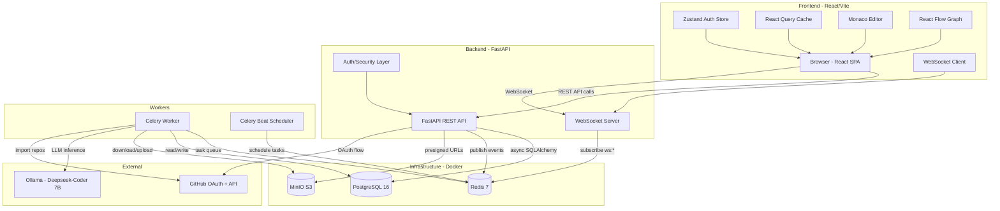
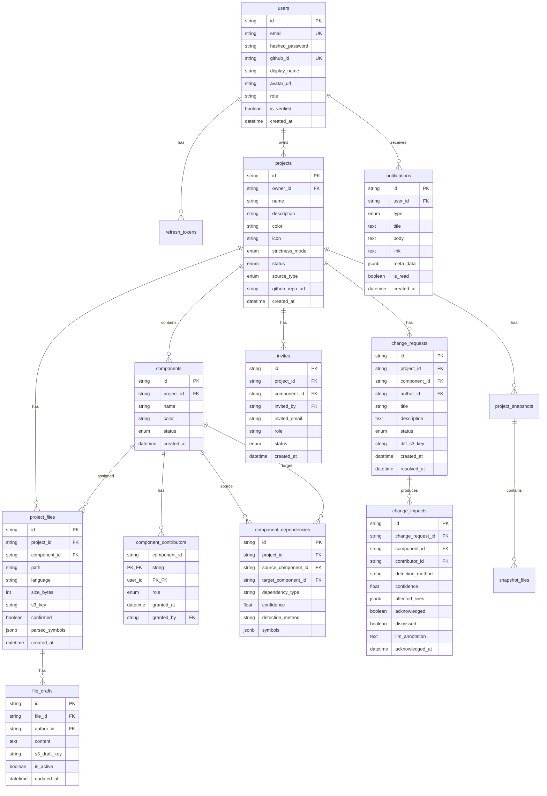
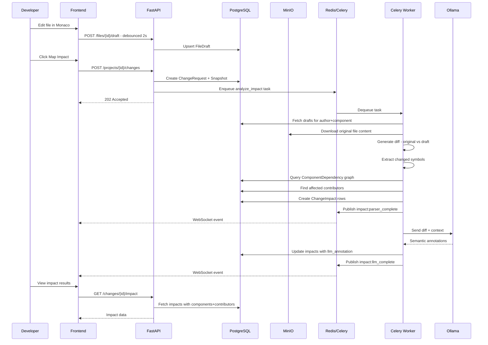

# Ripple — Full Codebase Analysis

## 1. Project Overview

**Ripple** is a **Change Impact Analyzer** — a change governance platform that maps the blast radius of every code change across a codebase. When a developer modifies code, Ripple:

1. **Analyzes** — Tree-sitter parsing + LLM (Deepseek-Coder) to detect affected files/symbols
2. **Notifies** — Personalized impact reports to every affected contributor
3. **Governs** — Gates merge behind contributor acknowledgements based on strictness mode

### Strictness Modes
| Mode | Behavior |
|---|---|
| **Visibility** | Maps impact and notifies. Owner can merge anytime. |
| **Soft Enforcement** | Nudges contributors. Auto-confirms after 24h. |
| **Full Governance** | Hard blocks merge until all contributors acknowledge. |

---

## 2. Architecture Diagram

---

## 3. Backend Architecture

### 3.1 Entry Point — [`main.py`](backend/app/main.py)

- FastAPI app with CORS middleware
- Lifespan handler: ensures MinIO bucket exists, starts Redis pub/sub listener
- Registers 7 routers under `/api/v1`
- WebSocket endpoint at `/api/v1/ws/{user_id}` with JWT auth and heartbeat

### 3.2 Core Infrastructure

| Module | File | Purpose |
|---|---|---|
| Config | [`config.py`](backend/app/core/config.py) | Pydantic Settings from `.env` — DB, Redis, S3, JWT, GitHub, Ollama |
| Database | [`database.py`](backend/app/core/database.py) | Async SQLAlchemy engine + session factory |
| Security | [`security.py`](backend/app/core/security.py) | bcrypt password hashing, JWT access/refresh tokens, `get_current_user` dependency |
| Storage | [`storage.py`](backend/app/core/storage.py) | S3/MinIO wrapper — presigned URLs, upload/download bytes, bucket management |
| Redis | [`redis.py`](backend/app/core/redis.py) | Async Redis client — pub/sub for WebSocket bridge |
| WebSocket | [`websocket.py`](backend/app/core/websocket.py) | ConnectionManager + Redis listener that forwards events to connected users |

### 3.3 Data Models

### 3.4 API Routers

| Router | File | Endpoints | Key Features |
|---|---|---|---|
| Auth | [`auth.py`](backend/app/api/v1/routers/auth.py) | register, login, me, logout, github, github/callback | Email+password auth, GitHub OAuth, refresh token rotation, auto-accept invites on register |
| Projects | [`projects.py`](backend/app/api/v1/routers/projects.py) | CRUD, confirm, invites list | Auto-creates Root component + owner contributor on project creation |
| Components | [`components.py`](backend/app/api/v1/routers/components.py) | CRUD, add/remove contributors | Real-time notifications via Redis pub/sub on contributor add |
| Files | [`files.py`](backend/app/api/v1/routers/files.py) | upload-url, confirm-batch, list, assign, content, draft, github-import | Presigned S3 URLs, Celery parsing trigger, GitHub repo import |
| Changes | [`changes.py`](backend/app/api/v1/routers/changes.py) | submit, list, impact, acknowledge, approve, dismiss | Snapshot creation, Celery impact analysis, strictness-gated approval |
| Notifications | [`notifications.py`](backend/app/api/v1/routers/notifications.py) | list, mark-read, invites CRUD | Paginated notifications, invite accept/decline with auto-contributor creation |
| Users | [`users.py`](backend/app/api/v1/routers/users.py) | search, collaborators | User search for assignment, cross-project collaborator listing |

### 3.5 Celery Tasks

| Task | File | Trigger | What it does |
|---|---|---|---|
| `parse_project` | [`parsing.py`](backend/app/tasks/parsing.py) | File upload confirm | Downloads files from S3, runs Tree-sitter, stores parsed_symbols JSONB, builds dependency graph |
| `import_github_repo` | [`parsing.py`](backend/app/tasks/parsing.py) | GitHub import confirm | Fetches repo tree via GitHub API, downloads raw files, uploads to S3, then runs parse_project |
| `analyze_impact` | [`impact.py`](backend/app/tasks/impact.py) | Change submission | Phase A: diffs drafts vs stable, finds dependent components via graph, creates ChangeImpact rows. Phase B: sends diff to Ollama LLM for semantic annotations |
| `auto_confirm_stale_impacts` | [`autoconfirm.py`](backend/app/tasks/autoconfirm.py) | Celery Beat every 1h | Auto-acknowledges impacts older than 24h, transitions CR to pending_review if all acknowledged |

### 3.6 Services

| Service | File | Purpose |
|---|---|---|
| Diff | [`diff.py`](backend/app/services/diff.py) | Unified diff generation using Python difflib |
| Language Detector | [`language_detector.py`](backend/app/services/language_detector.py) | File extension → language mapping |
| Parser | [`parser.py`](backend/app/services/impact/parser.py) | Tree-sitter TypeScript/JavaScript parsing + dependency graph builder |
| Graph | [`graph.py`](backend/app/services/impact/graph.py) | Advanced dependency graph builder with import resolution and symbol matching |
| LLM | [`llm.py`](backend/app/services/impact/llm.py) | Ollama Deepseek-Coder integration for semantic impact analysis |
| Extractors | [`extractors/`](backend/app/services/impact/extractors/__init__.py) | 10 language extractors: TypeScript, JavaScript, Python, Go, Rust, Java, C, C++, Ruby, C#, PHP |

---

## 4. Frontend Architecture

### 4.1 Tech Stack
- **React 19** + **Vite 6** + **TypeScript 5.8**
- **Tailwind CSS 4** for styling
- **Zustand** for auth state management
- **React Query** (`@tanstack/react-query`) for server state + caching
- **Monaco Editor** for in-browser code editing and diff view
- **React Flow** + **dagre** for dependency graph visualization
- **Framer Motion** for animations
- **Axios** for HTTP with interceptor-based token refresh

### 4.2 Routing — State-based (No React Router)

The app uses a state-based routing approach via [`App.tsx`](frontend3/src/App.tsx) with an `ActiveView` discriminated union type. Navigation is handled by `setView()` callbacks passed as props.

**Views:**
| View Type | Component | Description |
|---|---|---|
| `landing` | `DemoOne` + landing sections | Marketing/landing page with particles and spotlight effects |
| `auth` | [`AuthPage`](frontend3/src/components/AuthPage.tsx) | Login/register with email or GitHub OAuth |
| `auth-callback` | Loading screen | GitHub OAuth callback handler |
| `dashboard` | [`HomePage`](frontend3/src/components/HomePage.tsx) | Project list, quick stats, navigation |
| `project` | [`ProjectOverviewPage`](frontend3/src/components/ProjectOverviewPage.tsx) | Project detail with components, changes, contributors |
| `ide` | [`MonacoIDEPage`](frontend3/src/components/MonacoIDEPage.tsx) | Monaco editor with file tree, draft auto-save, change submission |
| `graph` | [`DependencyGraphPage`](frontend3/src/components/DependencyGraphPage.tsx) | React Flow dependency visualization |
| `history` | [`VersionHistoryPage`](frontend3/src/components/VersionHistoryPage.tsx) | Change history timeline |
| `change` | [`ChangeReviewPage`](frontend3/src/components/ChangeReviewPage.tsx) | Impact review, acknowledge, approve/merge |
| `settings` | [`ProjectSettingsPage`](frontend3/src/components/ProjectSettingsPage.tsx) | Project configuration, danger zone |
| `profile` | [`UserProfilePage`](frontend3/src/components/UserProfilePage.tsx) | User profile management |
| `global-notifications` | [`GlobalNotificationsPage`](frontend3/src/components/GlobalNotificationsPage.tsx) | All notifications |
| `global-changes` | [`GlobalChangesPage`](frontend3/src/components/GlobalChangesPage.tsx) | Cross-project changes feed |
| `global-teams` | [`GlobalTeamsPage`](frontend3/src/components/GlobalTeamsPage.tsx) | Collaborators across projects |
| `global-settings` | [`GlobalSettingsPage`](frontend3/src/components/GlobalSettingsPage.tsx) | App-wide settings |

### 4.3 API Client — [`api.ts`](frontend3/src/lib/api.ts)

- Axios instance with base URL from `VITE_API_URL`
- Request interceptor: attaches Bearer token from Zustand store
- Response interceptor: auto-refreshes on 401, retries original request
- Typed API modules: `authApi`, `projectsApi`, `componentsApi`, `filesApi`, `changesApi`, `notificationsApi`

### 4.4 Auth Store — [`authStore.ts`](frontend3/src/lib/authStore.ts)

Zustand store managing:
- `accessToken`, `user`, `isInitialized`
- `login()`, `register()`, `loginGithub()`, `logout()`, `refresh()`
- Bootstrap: [`main.tsx`](frontend3/src/main.tsx) calls `refresh()` before rendering to restore session from httpOnly cookie

### 4.5 WebSocket — [`useRippleSocket.ts`](frontend3/src/hooks/useRippleSocket.ts)

- Connects to `ws://host/api/v1/ws/{userId}?token={accessToken}`
- Exponential backoff reconnection (1s → 30s max)
- Event handler invalidates React Query caches:
  - `notification:new` → invalidate notifications
  - `project:files_ready` → invalidate project data
  - `impact:parser_complete` / `impact:llm_complete` → invalidate change impact
  - `change:acknowledged` / `change:approved` → invalidate changes + project

---

## 5. Data Flow — Impact Analysis Pipeline

---

## 6. Key Observations & Findings

### 6.1 Strengths

1. **Well-structured backend** — Clean separation: routers → models → services → tasks
2. **Async throughout** — AsyncPG + async SQLAlchemy + async Redis + async S3 operations
3. **Real-time updates** — Redis pub/sub bridge between Celery workers and WebSocket connections
4. **Multi-language parsing** — 10 language extractors with a clean abstract base class pattern
5. **Comprehensive auth** — Email/password + GitHub OAuth with refresh token rotation
6. **Snapshot system** — Before/after snapshots for change rollback capability
7. **Auto-confirm** — Celery Beat scheduled task for soft enforcement mode

### 6.2 Issues & Concerns

#### Backend Issues

1. **Duplicate `ParsedFile` definitions** — [`parser.py`](backend/app/services/impact/parser.py:22) defines its own `ParsedFile`/`ImportInfo`/`ExportInfo` dataclasses that conflict with the richer versions in [`extractors/base.py`](backend/app/services/impact/extractors/base.py:49). The parser only uses the simpler version.

2. **Duplicate `build_dependency_graph`** — Exists in both [`parser.py`](backend/app/services/impact/parser.py:121) (DB-based, used in production) and [`graph.py`](backend/app/services/impact/graph.py:14) (in-memory, more sophisticated but unused by tasks).

3. **Typo in dataclass** — [`ParsedFile.definitons`](backend/app/services/impact/parser.py:25) should be `definitions` (missing 'i').

4. **Only TypeScript/JavaScript parsing active** — The [`_parse_project_async`](backend/app/tasks/parsing.py:38) task only parses `typescript` and `javascript` files despite having extractors for 10 languages.

5. **`_run_async` pattern is fragile** — All Celery tasks use `asyncio.get_event_loop().run_until_complete()` which can fail if the event loop is already running. Should use `asyncio.run()` or a dedicated async Celery integration.

6. **No Pydantic response schemas** — All API responses are hand-built dicts. No validation on output, making the API contract implicit.

7. **Missing `SnapshotFile` in `__init__.py`** — [`SnapshotFile`](backend/app/models/component.py:125) is defined but not exported from [`models/__init__.py`](backend/app/models/__init__.py). Only `ProjectSnapshot` is exported.

8. **GitHub callback hardcoded redirect** — [`auth.py` line 290](backend/app/api/v1/routers/auth.py:290) redirects to `http://localhost:5173/auth/callback` instead of using a config variable.

9. **No rate limiting** — No rate limiting on auth endpoints (login, register) or API endpoints.

10. **S3 client is synchronous** — [`storage.py`](backend/app/core/storage.py) wraps synchronous boto3 calls in `run_in_executor`. Could use `aioboto3` for native async.

11. **Redis connection never closed** — [`close_redis()`](backend/app/core/redis.py:30) exists but is never called in the lifespan handler.

12. **`approve_change` hardcodes `.ts` extension** — [`changes.py` line 323](backend/app/api/v1/routers/changes.py:323) creates new S3 keys with `.ts` extension regardless of actual file type.

#### Frontend Issues

13. **No URL-based routing** — State-based routing means browser back/forward doesn't work, URLs aren't shareable, and page refresh loses navigation state.

14. **API type mismatches** — [`filesApi.requestUploadUrls`](frontend3/src/lib/api.ts:248) sends `{path, size_bytes, language}` but backend expects `{name, size, content_type}`.

15. **`notificationsApi.createInvite`](frontend3/src/lib/api.ts:303) posts to `/invites` but backend endpoint is `POST /projects/{project_id}/invites`** — URL mismatch.

16. **`projectsApi.getProject`](frontend3/src/lib/api.ts:203) calls `/projects/{id}/overview` which doesn't exist** — Backend only has `GET /projects/{id}`.

17. **`filesApi.githubPreview`](frontend3/src/lib/api.ts:258) doesn't send `branch` parameter** — Backend expects `{repo_url, branch}`.

18. **`filesApi.githubConfirm`](frontend3/src/lib/api.ts:262) sends `{owner, repo, paths}` but backend expects `{repo_url, branch, selected_paths}`** — Complete mismatch.

19. **`ApiNotification` type mismatch** — Frontend type has `message` and `read` fields but backend returns `title`, `body`, and `is_read`.

20. **`ChangeImpact.confidence` typed as `string`** — Should be `number` to match backend's `Float` column.

21. **Unused dependencies** — `better-sqlite3`, `express`, `dotenv`, `json-stable-stringify` in [`package.json`](frontend3/package.json) appear unused for a Vite SPA.

22. **`@google/genai` dependency** — Suggests Gemini AI integration that isn't visible in the codebase.

23. **`vite.config.ts` references `GEMINI_API_KEY`** — [`vite.config.ts`](frontend3/vite.config.ts:11) exposes a Gemini API key that doesn't appear to be used.

#### Security Concerns

24. **GitHub access tokens stored in plaintext** — [`User.github_access_token`](backend/app/models/user.py:21) stores OAuth tokens unencrypted in the database.

25. **No input validation on strictness_mode** — [`ProjectUpdate`](backend/app/api/v1/routers/projects.py:29) accepts any string for `strictness_mode` without validating against the enum.

26. **SQL injection risk in user search** — [`users.py`](backend/app/api/v1/routers/users.py:20) uses `ilike(f"%{q}%")` which, while parameterized by SQLAlchemy, could benefit from explicit sanitization.

27. **Bucket policy is public-read** — [`storage.py`](backend/app/core/storage.py:36) sets `s3:GetObject` for `Principal: *`, meaning anyone with a key path can read files.

---

## 7. File Size Summary

| Area | Files | Largest Files |
|---|---|---|
| Backend Routers | 8 files | `changes.py` (16KB), `files.py` (17KB) |
| Backend Models | 4 files | `component.py` (7.6KB), `change.py` (5.8KB) |
| Backend Services | 7+ files | `typescript.py` extractor (12KB), `parser.py` (8.4KB) |
| Backend Tasks | 3 files | `impact.py` (6.4KB), `parsing.py` (6KB) |
| Frontend Components | 17 files | `NewProjectWizard.tsx` (54KB), `ChangeReviewPage.tsx` (45KB), `ProjectSettingsPage.tsx` (40KB) |
| Frontend Lib | 3 files | `api.ts` (11KB) |

---

## 8. Summary

Ripple is a well-conceived change governance platform with a solid architectural foundation. The backend follows clean patterns with async SQLAlchemy, Celery task queues, and real-time WebSocket updates. The frontend is a feature-rich React SPA with Monaco Editor integration and dependency graph visualization.

The primary areas needing attention are:
1. **Frontend-backend API contract mismatches** (items 14-20) — Several API calls won't work as-is
2. **Duplicate/unused code** in the parser/graph services (items 1-2)
3. **Only 2 of 10 language extractors are wired up** in the parsing task (item 4)
4. **No URL-based routing** in the frontend (item 13)
5. **Security hardening** needed for production (items 24-27)
